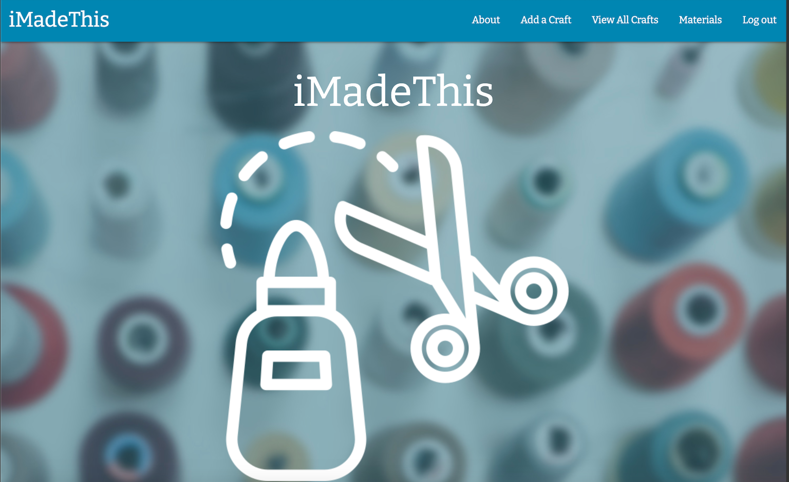
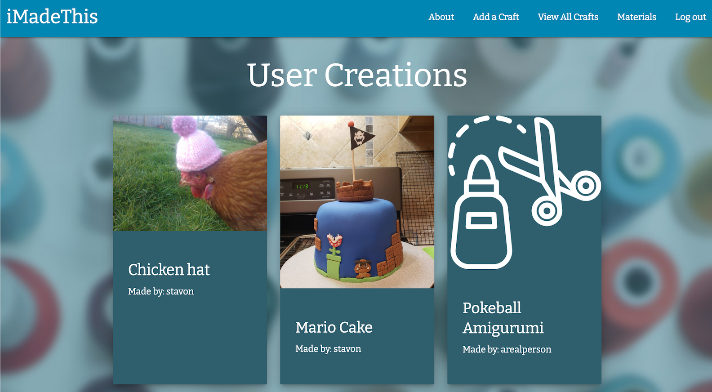

# iMadeThis
### Unit 4 Project for General Assembly SEI

iMadeThis is a Full-stack Django App deployed using Heroku. This app is a place to share your crafts and DIY projects for others to see, complete with photos! 

-----

### Screenshots

-----

### User Stories
- AAU I should be able to:
  - sign up
  - log in
  - view a list of crafts
  - add a craft
  - edit/delete my craft
  - add a photo to my craft
  - view a list of materials
  - add a material
  - add a material to my craft
  - edit/delete a material

-----

### Technologies Used
- HTML
- CSS
- Javascript
- Materialize
- Python
- Django
- AWS
- PostgreSQL
- [Images from Pexels](https://pexels.com)
- [Fonts by Google](https://fonts.google.com/)
- Icons made by [freepik](http://www.freepik.com/) from [flaticon](https://www.flaticon.com/)

-----

### Links

See the [Trello](https://trello.com/b/WBnZJ8Pz/imadethis) board.
Check out [iMadeThis](https://imadethiss.herokuapp.com/)!

-----

### Future enhancements

I'd like to add a 'like' feature so users can like individual crafts.
I'd also like to add a filter function to the craft list page that will allow you to only view your crafts, or view crafts based on what materials they used, etc. 
